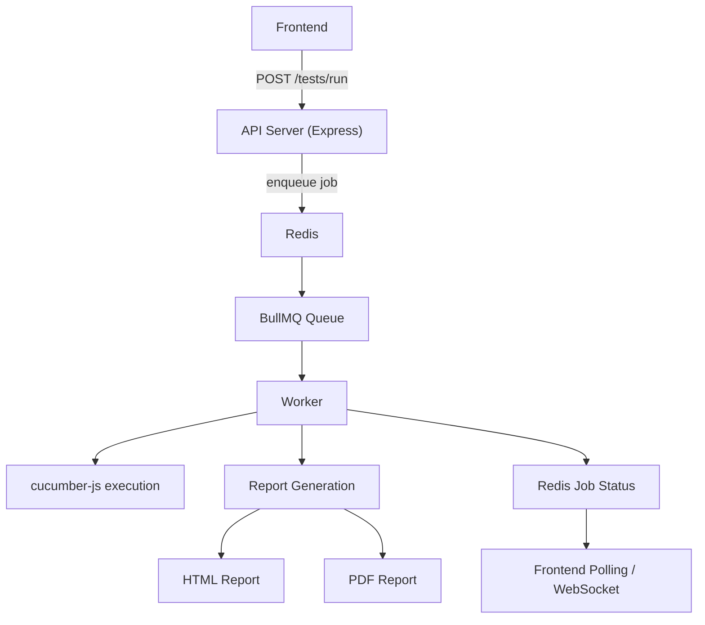
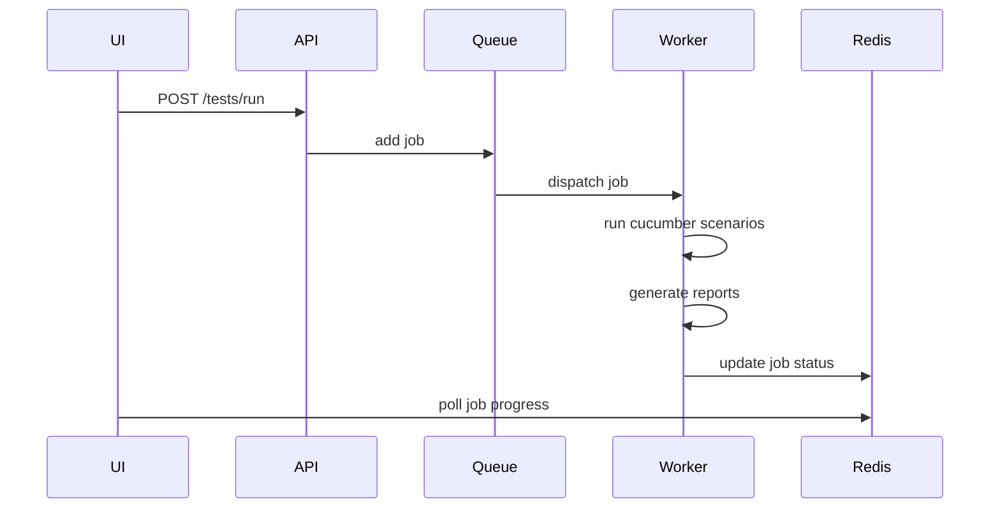

# API Test Platform

Async API scenario testing platform using **Express + BullMQ + Redis + Cucumber**.

---

# Architecture



---

# System Flow



---

# Project Structure

```
src
├── config
│ ├── client.config.js
│ └── redis.config.js
│
├── queues
│ └── test.queue.js
│
├── workers
│ └── test.worker.js
│
├── services
│ ├── api.service.js
│ ├── cucumber.service.js
│ └── report.service.js
│
├── controllers
│ └── test.controller.js
│
├── routes
│ └── test.routes.js
│
├── jobs
│ └── job.service.js
│
└── utils
  └── logger.js

```

const path = require("path");
const fs = require("fs");
const puppeteer = require("puppeteer");

const MAX_REPORTS = 10;

// ---------------------
// Base Reporter
// ---------------------
class BaseReporter {
constructor() {
this.baseDir = path.join(process.cwd(), "reports");
this.jsonDir = path.join(this.baseDir, "json");
this.runsDir = path.join(this.baseDir, "runs");
this.maxReports = MAX_REPORTS;
}

ensureDir(dir) {
if (!fs.existsSync(dir)) fs.mkdirSync(dir, { recursive: true });
}

cleanupReports() {
if (!fs.existsSync(this.runsDir)) return;

    const folders = fs
      .readdirSync(this.runsDir)
      .map((name) => {
        const p = path.join(this.runsDir, name);
        return { name, path: p, time: fs.statSync(p).mtime.getTime() };
      })
      .filter((f) => fs.statSync(f.path).isDirectory())
      .sort((a, b) => a.time - b.time);

    while (folders.length >= this.maxReports) {
      const oldest = folders.shift();
      fs.rmSync(oldest.path, { recursive: true, force: true });
    }

}

async generatePdf(htmlPath, reportDir) {
const browser = await puppeteer.launch({
args: ["--no-sandbox", "--disable-setuid-sandbox"],
});

    const page = await browser.newPage();
    await page.goto(`file://${htmlPath}`, { waitUntil: "networkidle0" });

    const pdfPath = path.join(reportDir, "report.pdf");
    await page.pdf({ path: pdfPath, format: "A4", printBackground: true });

    await browser.close();

    return `/reports${pdfPath.replace(path.join(process.cwd(), "reports"), "")}`.replace(
      /\\/g,
      "/",
    );

}

toPublicPath(absPath) {
return `/reports${absPath.replace(path.join(process.cwd(), "reports"), "")}`.replace(
/\\/g,
"/",
);
}
}

// ---------------------
// Multiple Cucumber HTML Reporter
// ---------------------
class MultipleCucumberReporter extends BaseReporter {
constructor() {
super();
this.multipleCucumberReporter = require("multiple-cucumber-html-reporter");
}

async generate(format = "html") {
this.ensureDir(this.jsonDir);
this.ensureDir(this.runsDir);
this.cleanupReports();

    const files = fs
      .readdirSync(this.jsonDir)
      .filter((f) => f.endsWith(".json"));
    if (!files.length) throw new Error("No Cucumber JSON files found.");

    const timestamp = new Date().toISOString().replace(/[:.]/g, "-");
    const reportDir = path.join(this.runsDir, timestamp);
    fs.mkdirSync(reportDir);

    this.multipleCucumberReporter.generate({
      jsonDir: this.jsonDir,
      reportPath: reportDir,
      openReportInBrowser: false,
      displayDuration: true,
      durationInMS: true,
      displayReportTime: true,
    });

    const htmlPath = path.join(reportDir, "index.html");
    if (format === "pdf") return await this.generatePdf(htmlPath, reportDir);
    return this.toPublicPath(htmlPath);

}
}

// ---------------------
// Serenity/JS Reporter
// ---------------------
class SerenityReporter extends BaseReporter {
constructor() {
super();
this.resultsDir = this.runsDir; // use same runs folder
}

async generate(format = "html") {
this.ensureDir(this.runsDir);
this.cleanupReports();

    const folders = fs
      .readdirSync(this.resultsDir)
      .map((name) => path.join(this.resultsDir, name))
      .filter((p) => fs.statSync(p).isDirectory())
      .sort(
        (a, b) =>
          fs.statSync(b).mtime.getTime() - fs.statSync(a).mtime.getTime(),
      );

    if (!folders.length) throw new Error("No Serenity/JS reports found.");

    const latestFolder = folders[0];
    const htmlPath = path.join(latestFolder, "index.html");

    if (!fs.existsSync(htmlPath)) {
      console.warn("Serenity/JS report not found in latest folder.");
    }

    if (format === "pdf") {
      return await this.generatePdf(htmlPath, latestFolder);
    }

    return this.toPublicPath(htmlPath);

}
}

// ---------------------
// Reporter Factory
// ---------------------
function getReporter() {
const type = process.env.REPORTER_TYPE || "serenity"; // default to multiple-cucumber
if (type === "serenity") return new SerenityReporter();
return new MultipleCucumberReporter();
}

module.exports = getReporter();

and have a default with the default cucumber report, make it configurable via a config file
replace serenity with a clean karate implementation give me the steps to implement from the start, including my cucumber.js at root, the package json, the cucmber service if needed

```
cucumber.js
frontend
├── app.js
└── index.html
reports
└── runs
    └──2026-03-11T06-23-25-755Z
        └── index.html
src
├── config
│ ├── client.config.js
│ └── redis.config.js
│
├── queues
│ └── test.queue.js
│
├── workers
│ └── test.worker.js
│
├── services
│ ├── api.service.js
│ ├── cucumber.service.js
│ └── report.service.js
│
├── controllers
│ └── test.controller.js
│
├── routes
│ └── test.routes.js
│
├── jobs
│ └── job.service.js
│
├── utils
│ └── logger.js
│
├── server.js
│
└── app.js


```

---

# Required Services

Start Redis:

```bash
redis-server
```

Run API server:

```bash
node src/server.js
```

Run worker:

```bash
node src/workers/test.worker.js
```

---

# API

Run tests

```
POST /tests/run
```

Body

```json
{
  "format": "html"
}
```

Response

```json
{
  "jobId": "123",
  "status": "queued"
}
```

---

# Queue Monitoring

BullMQ dashboard:

```
/admin/queues
```

Features

- job history
- retries
- progress
- failure logs

Project

https://github.com/felixmosh/bull-board

---

# Worker Responsibilities

Worker performs:

1. Execute cucumber scenarios
2. Generate HTML report
3. Generate PDF report
4. Update job progress
5. Store job metadata in Redis

---

# Reliability

Retry logic

```js
queue.add("run-tests", data, {
  attempts: 3,
  backoff: { type: "exponential", delay: 2000 },
});
```

Reference  
https://docs.bullmq.io/guide/retrying-failing-jobs

---

# Production Capabilities

✔ async job execution  
✔ queue reliability  
✔ job monitoring  
✔ HTML + PDF reports  
✔ cancellable tests  
✔ progress tracking  
✔ scalable workers
