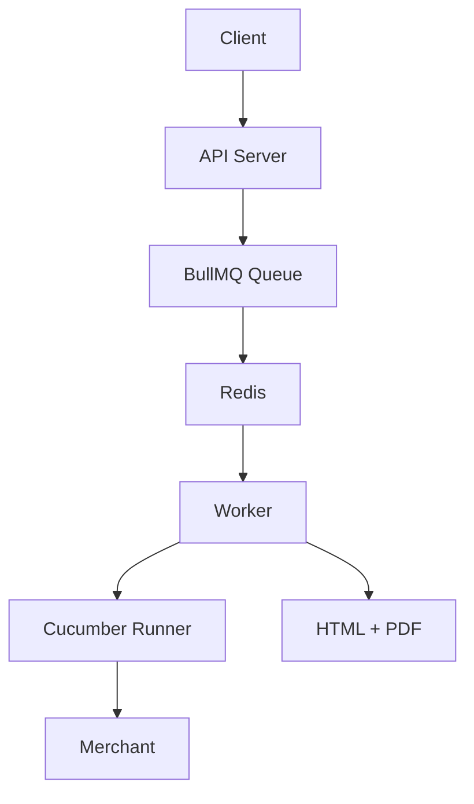
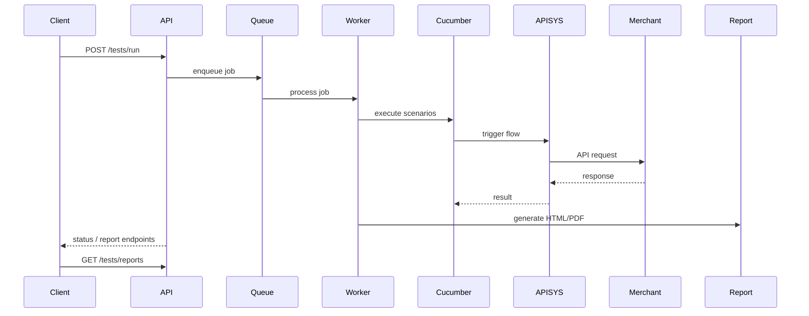
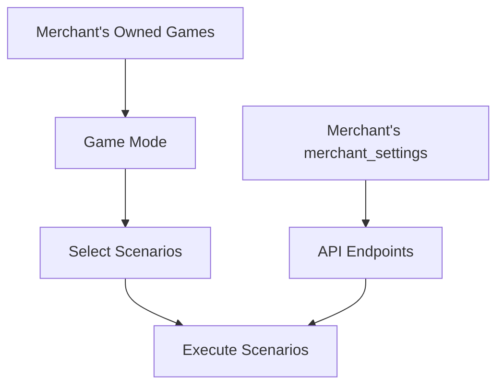

# API Test Platform

Async API scenario testing platform for **merchant wallet integration**.

---

# 1. Architecture & Tech Stack

## Stack

- Express: API layer  
- BullMQ + Redis: async job processing  
- Cucumber: scenario execution  
- HTML Reporter: report generation  
- Puppeteer: PDF export  

---

## Core Architecture



---

## Async Execution Model

Test runs are executed using **Job → Queue → Worker**.

### Job
- created via `POST /tests/run`
- represents one test run
- tracked by `jobId`

### Queue (BullMQ + Redis)
- stores jobs
- schedules execution
- controls concurrency
- supports retry and cancellation

### Worker
- processes jobs
- selects scenarios
- runs Cucumber
- calls APIs via configured endpoints
- captures request/response
- generates reports

### Why

- non-blocking API
- parallel execution
- persistent jobs (Redis)
- controllable runs (cancel/retry)

---

# 2. Execution Flow



### Output

```
reports/runs/<timestamp>/
  index.html
  report.pdf
```

Each run includes:

- request + response payloads  
- error payloads  
- structured error context  

---

# 3. Validation & Scenario Model

## What is Validated

> APISYS → Merchant requests  
> Merchant → APISYS responses  

Checks:

- request structure and payload  
- response format and values  
- error handling  

---

## How Scenarios Are Determined

Two inputs control execution:

### 1. Game Wallet Mode (what scenarios to test)

- Seamless → wallet operation APIs (request-payment, settle, etc.)  
- Transfer Wallet → transfer APIs (transfer-in/out, cancel-transfer)  

---

### 2. Merchant Wallet Mode 

Defines the actual API endpoints to be called:

- Seamless → points to merchant APIs  
- Transfer Wallet → points to APISYS APIs  

---

## Resolution Flow



### Rules

- **Game mode determines scenarios**
- **Merchant mode (merchant_settings) determines API endpoints**

---

## Test Coverage

### General

| Code | Feature |
|------|--------|
| AMO001 | get-member-wallet-balance |
| AMO013 | notify-wager-update |

---

### Seamless (Wallet APIs)

| Code | Feature |
|------|--------|
| AMO003 | request-payment |
| AMO004 | notify-payment-failed |
| AMO007 | settle-wager |
| AMO008 | cancel-wager |
| AMO009 | resettle-wager |
| AMO012 | undo-wager |

---

### Transfer Wallet (Transfer APIs)

| Code | Feature |
|------|--------|
| AMO010 | transfer-in |
| AMO011 | transfer-out |
| AMO014 | cancel-transfer |

---

## Summary

| Merchant Mode | Game Mode | API Target |
|--------------|----------|------------|
| Seamless | Seamless | Merchant APIs |
| Seamless | Transfer | Merchant APIs |
| Transfer | Seamless | APISYS APIs |
| Transfer | Transfer | APISYS APIs |

---

# 4. API

| Method | Route |
|--------|------|
| POST | `/tests/run` |
| GET | `/tests/status/:id` |
| DELETE | `/tests/cancel/:id` |
| GET | `/tests/reports` |

---

# 5. Setup & Running

## 1. Install

```bash
npm install
```

---

## 2. Environment

```bash
cp .env.example .env
```

Update `.env` with required values.

---

## 3. Start

```bash
# start redis
redis-server

# start api
npm run dev

# start worker
npm run worker

# run all
npm run full
```

---

# 6. Usage

### Start Run

```http
POST /tests/run
```

```json
{
  "format": "html"
}
```

---

### Check Status

```http
GET /tests/status/:id
```

---

### Cancel Run

```http
DELETE /tests/cancel/:id
```

---

### Get Reports

```http
GET /tests/reports
```
